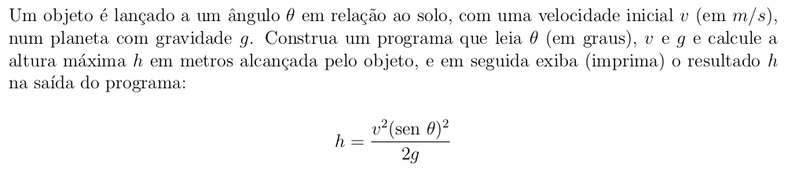

# Altura-maxima_movimento-obliquo-thehuxley
https://www.thehuxley.com/problem/3127?locale=pt_BR

Um objeto é lançado a um ângulo (theta) em relação ao solo, com uma velocidade inicial v (em m/s), num planeta com gravidade g. Construa um programa que leia o ângulo (theta) em graus, a velocidade v e a gravidade g e calcule a altura máxima h em metros alcançada pelo objeto, e em seguida exiba (imprima) o resultado h na saída do programa.

<p align="center">
    
</p>

### Formato de entrada
Leia 3 números decimais (floats) representando:

- O ângulo theta em graus.

- A velocidade v.

- A gravidade g.

### Formato de saída
Um número decimal (float) representando a altura máxima em metros alcançada pelo objeto.

### Exemplos de:
Entrada
```txt
15
100
9.8
```
Saída
```txt
34.17719291213299
```
